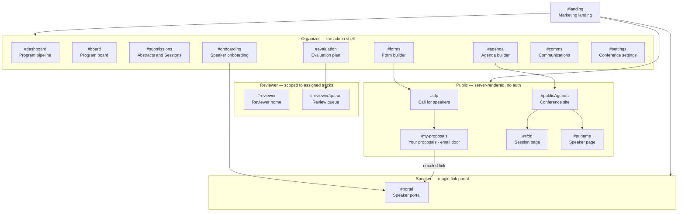
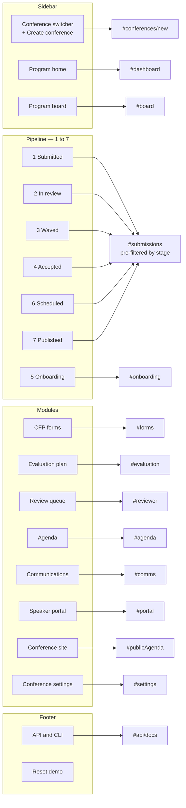
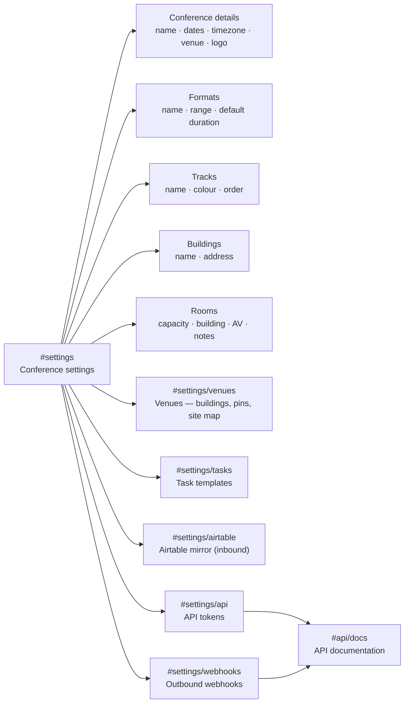
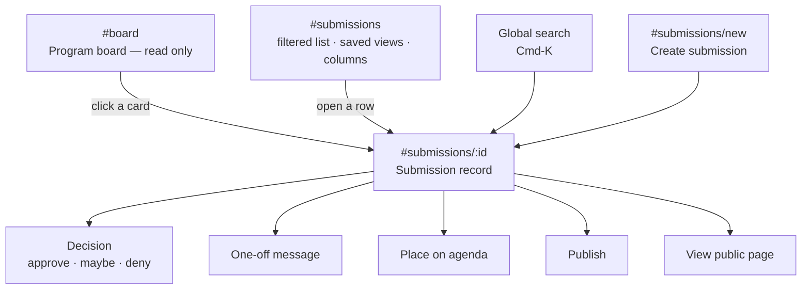
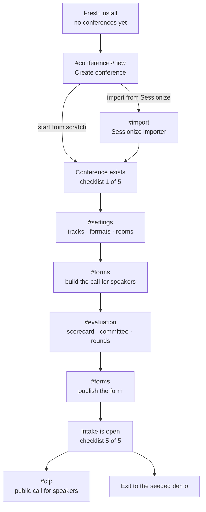
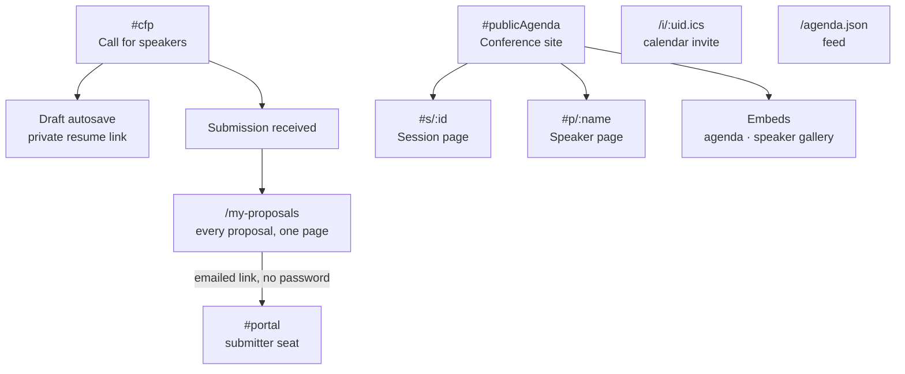

# Marquee — Site map

Every screen in Marquee, who reaches it, and how they get there. Routes are the
hash routes the prototype ships (`prototypes/pipeline-v1.1/index.html`); the
built app serves the same paths per `SPEC.md` §5.

Four audiences share one product: the **organizer** (the program team), the
**speaker**, the **reviewer**, and the **public**. Only the organizer sees the
full sidebar; the other three each meet one surface and nothing else.

---

## 1. The whole site

---

## 2. Organizer navigation — the sidebar

The sidebar is the organizer's whole map: brand, conference switcher, Program home,
the seven pipeline stages, then the modules. Every module is one click from home.

---

## 3. Settings and its sub-routes

---

## 4. The record spine

Everything an organizer does converges on one submission record. The board and
the lists are ways of finding it; the record owns every consequential action.

---

## 5. The fresh install — cold start to open intake

A brand-new install has no conference. This is the walk that creates one, reachable
from `?empty=1` on any route and sticky until exited.

---

## 6. Public surfaces

The only routes served without auth. Nothing private leaks here: unpublished
titles have no public permalink.

---

## 7. Route table

| Route | Screen | Seat |
|---|---|---|
| `#landing` | Marketing landing | Public |
| `#conferences/new` | Create conference | Organizer |
| `#dashboard` | Program pipeline | Organizer |
| `#board` | Program board | Organizer |
| `#submissions` | Abstracts and Sessions | Organizer |
| `#submissions/new` | Create submission | Organizer |
| `#submissions/:id` | Submission record | Organizer |
| `#forms` | Form builder | Organizer |
| `#evaluation` | Evaluation plan | Organizer |
| `#evaluation/ai` | AI assist (optional, off the demo path) | Organizer |
| `#reviewer` | Reviewer home | Reviewer |
| `#reviewer/queue` | Review queue | Reviewer |
| `#onboarding` | Speaker onboarding — the chase board | Organizer |
| `#agenda` | Agenda builder | Organizer |
| `#comms` | Communications | Organizer |
| `#settings` | Conference settings | Organizer |
| `#settings/venues` | Venues — buildings, coordinates, site map | Organizer |
| `#settings/tasks` | Task templates | Organizer |
| `#settings/airtable` | Airtable mirror (inbound) | Organizer |
| `#settings/api` | API tokens | Organizer |
| `#settings/webhooks` | Outbound webhooks — endpoints, test delivery, deliveries log | Organizer |
| `#api/docs` | API documentation | Organizer |
| `#import` | Sessionize importer | Organizer |
| `#portal` | Speaker portal | Speaker |
| `#cfp` | Public call for speakers | Public |
| `/my-proposals` | Your proposals — the submitter's email door (aliases `/my-submissions`, `/proposals`) | Public |
| `#publicAgenda` | Conference site | Public |
| `#s/:id` | Public session page | Public |
| `#p/:name` | Public speaker page | Public |

Append `?empty=1` to any route to enter the fresh-install walk.
