# Marquee — State map

Every lifecycle in the product, and — where it matters — whether a state is
**stored** or **derived**. Getting that distinction wrong is how a program tool
starts lying to its operator, so it is called out at each machine.

Vocabulary is the organizer's, per `PHILOSOPHY.md` 6: Abstract, Session,
Speaker, Evaluation plan, Round, Scorecard, Committee, Portal, Task, Agenda.

---

## 1. Submission status — the one stored enum

`submissions.status` is the single stored lifecycle. Seven values, complete from
the first migration. **`waitlisted` displays as "Maybe"** — the reviewer floor is
approve / maybe / deny, so the judge meets their own word.

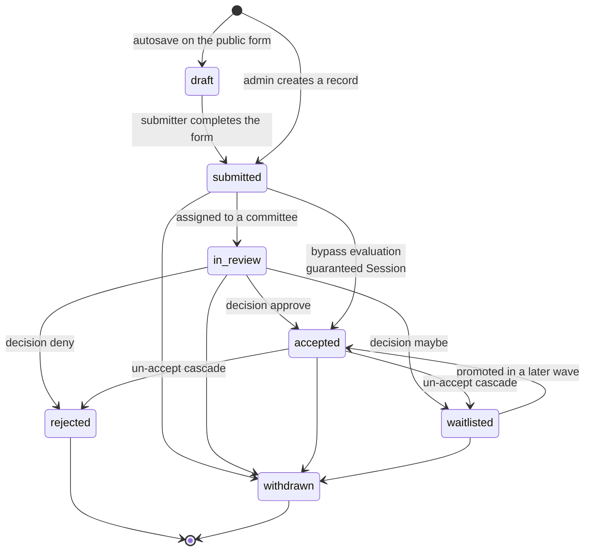

**Every transition into `accepted`, `waitlisted`, or `rejected` writes a decision
row** — one-at-a-time and bulk alike. That is what keeps the acceptance email and
the portal from rendering the outcome through different paths.

---

## 2. Pipeline stage — derived, never stored

The seven stages on the dashboard and the board are **computed from status plus
agenda placement**. There is no `stage` column. This is why placing a session on
the agenda moves it on the board without anybody setting a field.

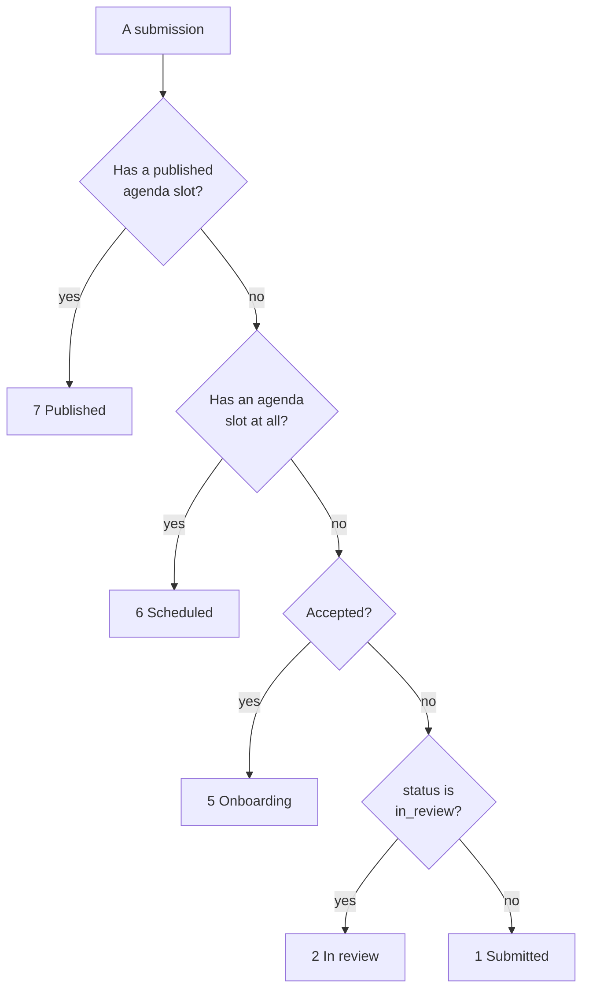

**Waved** (stage 3) is the acceptance batch a record belongs to, not a status —
a record is accepted *in* a wave.

---

## 3. Abstract vs Session — two kinds, one table

The distinction the walkthrough video makes and that is easy to get wrong.

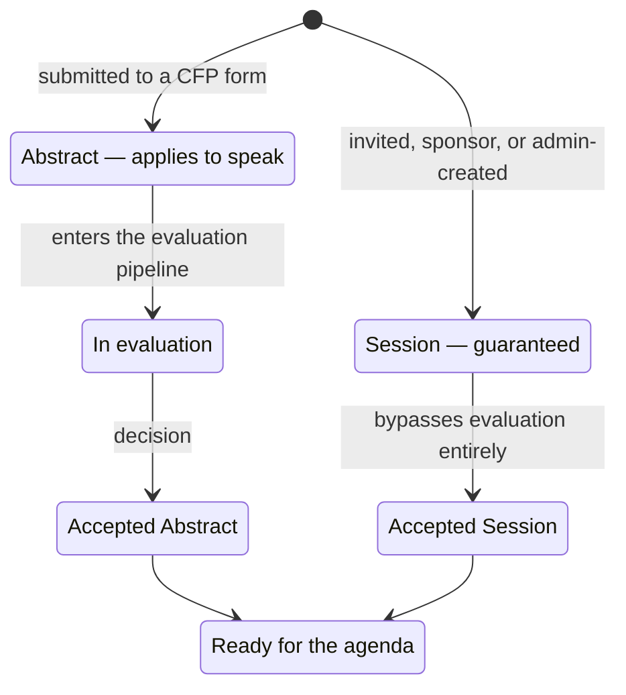

Only submissions whose status is in `event_settings.schedulable_statuses`
(default `['accepted']`) may be placed. Sessions with `bypass_evaluation`
qualify without an evaluation record.

---

## 4. CFP form lifecycle

The form the organizer builds, and the public page it produces.

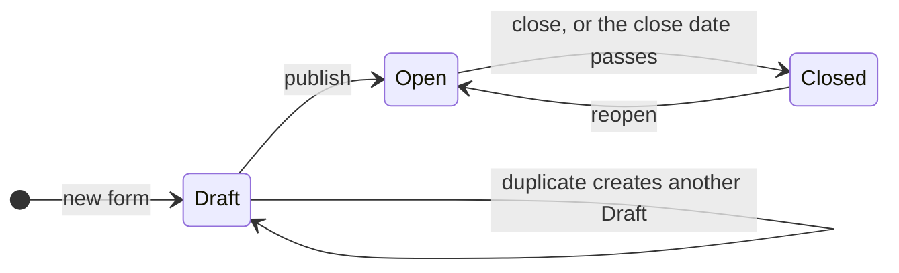

The public page it renders has four states of its own:

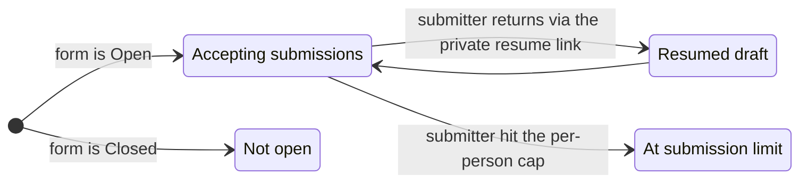

The builder walks seven steps: Type and basics → Welcome → Form fields →
Participants → Rules and routing → Messages → Publish.

---

## 5. Evaluation — rounds, queue, and the reviewer's verdict

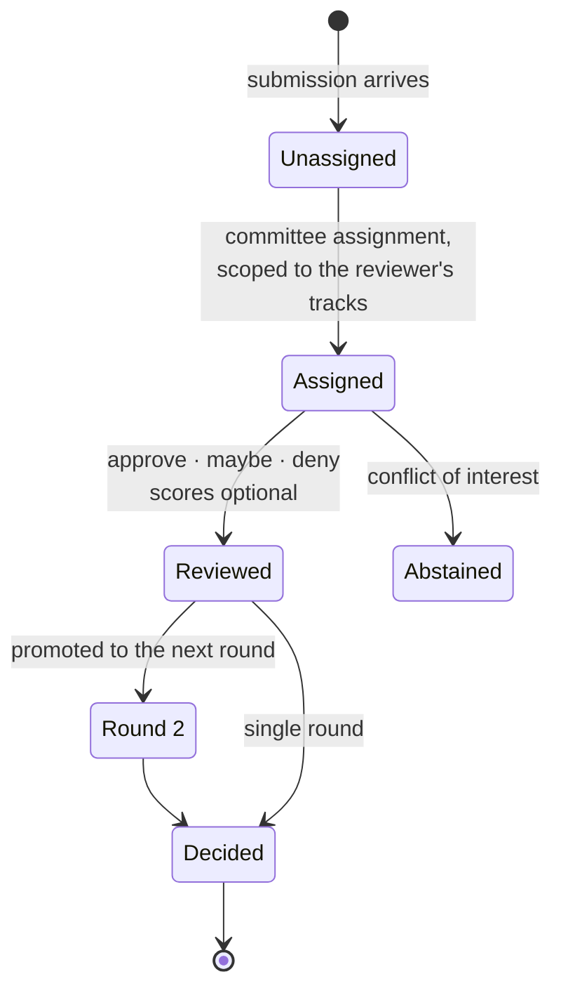

A reviewer sees only submissions intersecting their assigned tracks, and
anonymised responses have identity stripped **from the query payload, not the
template**.

---

## 6. Speaker onboarding — the chase

The moat. An acceptance assigns a task set; the system does the chasing.

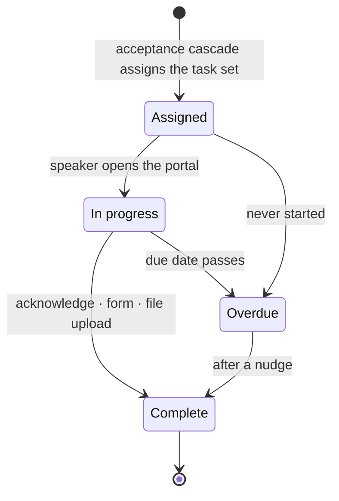

Three task kinds, each with its own completion payload:

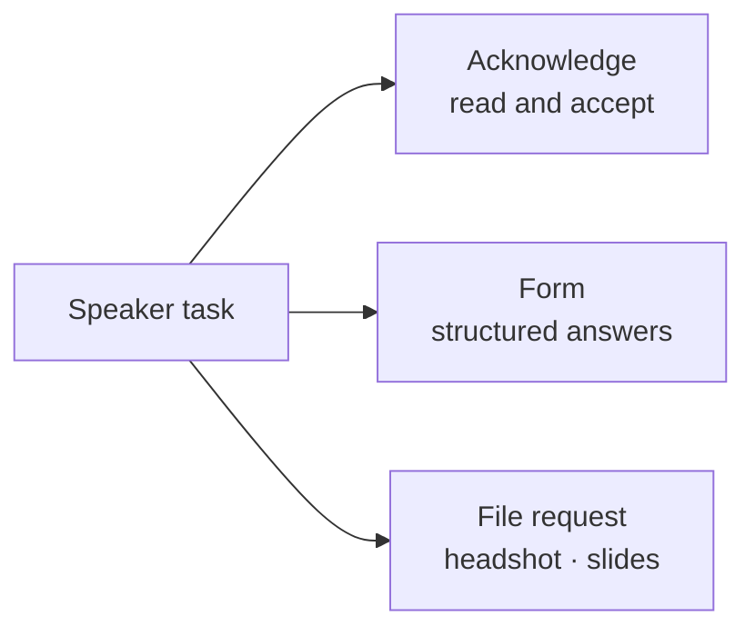

Severity on the chase board is derived from how overdue the *worst* outstanding
task is — a speaker is at risk because of their tasks, not by a flag.

---

## 7. Acceptance cascade

What a status change actually sets in motion. `PHILOSOPHY.md` 2: the status
change **is** the notification.

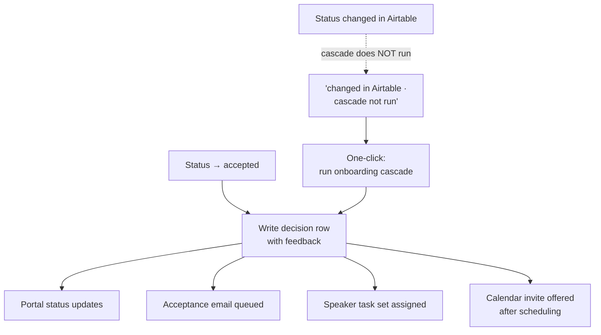

An inbound mirror write sets the status and stops. Cascading on inbound would
let a spreadsheet edit mass-mail hundreds of speakers.

---

## 8. Agenda item

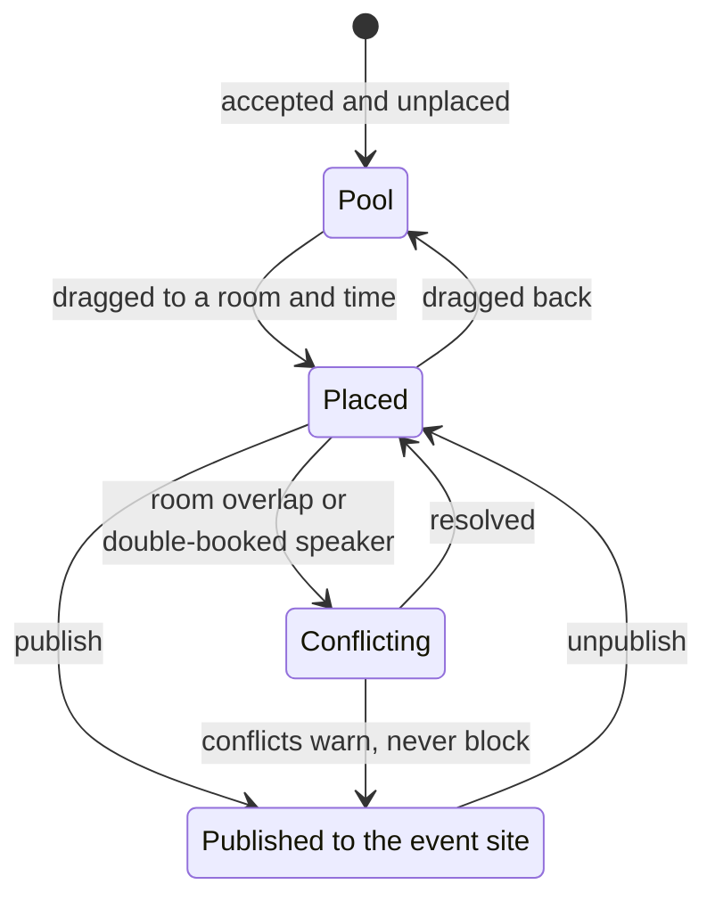

There is no save button — placement persists as it happens. Five views over the
same data: List · Day · Week · Track · Room. **No Month view.**

---

## 9. Calendar invite

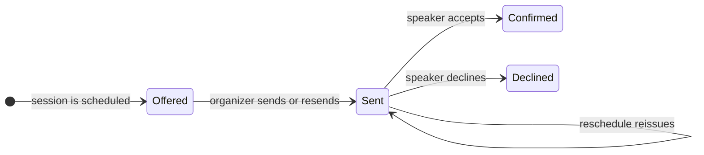

Delivered as ICS `METHOD:REQUEST` at a stable invite URL. OAuth calendar write is
a documented extension point, not a shipped path.

---

## 10. Airtable mirror

D1 is the source of truth. The mirror never sits on a request path.

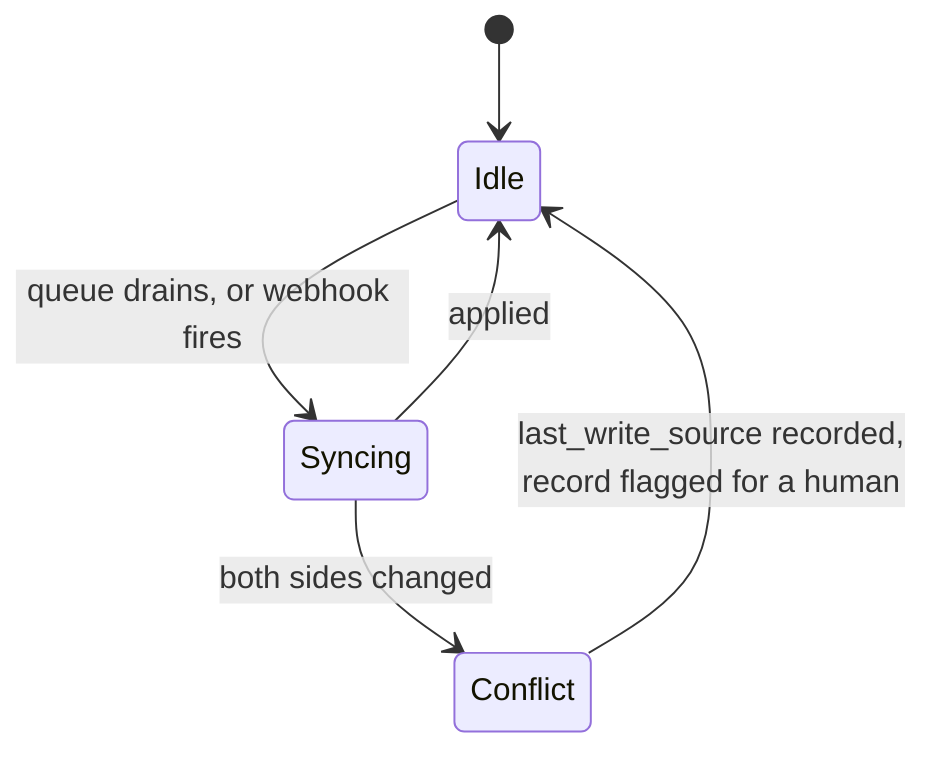

---

## 11. The fresh-install walk

The setup state a brand-new install starts in. Steps complete from **real work**,
not from visiting the screen: taxonomy ticks when the event genuinely has tracks,
formats, and rooms; intake ticks when a form is genuinely published.

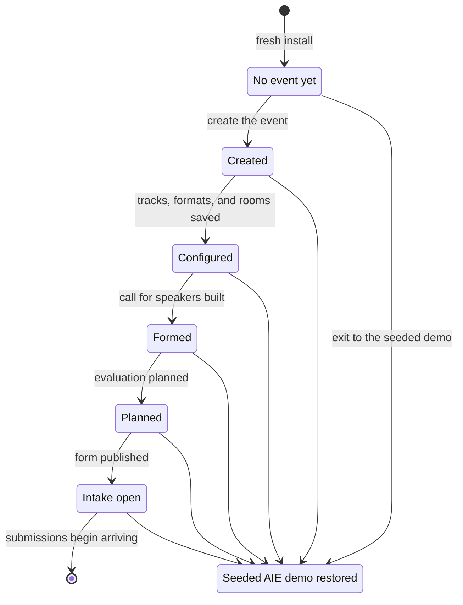

The walk is a sandbox: it holds the seeded demo whole in a snapshot, restores it
on exit, and never persists its own event over the demo's.

---

## 12. Import from Sessionize

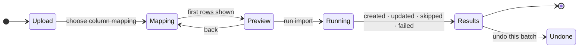

Matching is idempotent by Sessionize ID — re-running an export updates matches
and inserts new records without duplicating anything.
